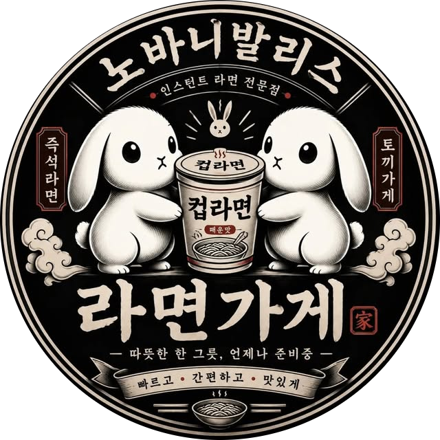

# QOH99 SE Launcher · tikiland



**0.2.3 테스트 버전** · 배포자 **tikiland** · Thread-@tikiland.t

원본 **Queen of Heart 99 SE**용 Windows 런처입니다. 화면·필터·1P/2P 키를
한곳에서 설정할 수 있습니다. 이 ZIP에는 원본 게임이 들어 있지 않습니다.

**[런처 ZIP 다운로드](https://github.com/unkkyuist/qoh99seLauncher/releases/tag/v0.2.3)**
· **[처음부터 따라 하는 상세 설치 방법](INSTALL.md)**
· [문제 제보](https://github.com/unkkyuist/qoh99seLauncher/issues)

> 원본 게임은 별도로 준비해야 합니다. 현재 응답 없음 보고를 조사 중이므로
> 첫 실행은 **원본 도트 (Nearest) + 추가 효과 없음**으로 확인해 주세요.
> 이 버전은 해당 멈춤 문제의 해결을 확인한 버전이 아닙니다.

## 사용 방법

1. 다운로드 페이지의 **Assets**에서 `QOH-Launcher-0.2.3.zip`을 받습니다.
   `Source code (zip)`은 실행용 배포 파일이 아닙니다.
2. QOH99·런처·원본 설정 도구를 종료하고, 받은 ZIP을 별도 폴더에 압축 해제합니다.
3. **기존 게임 폴더 전체를 다른 위치에 복사해 백업**합니다.
   이미 사용하던 `ddraw.dll` 또는 `ddraw.ini`도 이 백업에 포함되어야 합니다.
4. 압축을 푼 **내용 전체**를 본인의 `qoh99.exe`가 있는 폴더로 복사합니다.
   `QOH-Launcher.exe`, `ddraw.dll`, `ddraw.ini`가 `qoh99.exe`와 나란히 있어야 합니다.
5. `QOH-Launcher.exe`를 실행해 원본 도트·추가 효과 없음으로 **게임 시작**을 누릅니다.

설치 후 핵심 파일은 다음처럼 같은 위치에 있어야 합니다.

```text
내 QOH99 SE 게임 폴더/
├─ qoh99.exe                 ← 본인이 보유한 원본 게임
├─ Config.exe                ← 원본 설정 도구
├─ System/                   ← 원본 게임 데이터, 그대로 유지
├─ QOH-Launcher.exe          ← 이번에 받은 런처
├─ ddraw.dll                 ← 화면 호환 패치
├─ ddraw.ini                 ← 화면 패치 설정
├─ LauncherShaders/          ← 폴더째 복사
└─ ...                       ← 나머지 원본/배포 파일
```

백업·첫 실행·업데이트·삭제·복구의 전체 순서는 **[상세 설치 가이드](INSTALL.md)**를 확인하세요.

Windows 10/11용 32비트 실행 파일이며, 64비트 Windows에서도 실행됩니다.
Microsoft C++ 런타임은 정적으로 연결했습니다. 관리자 권한이 필요하지 않도록
사용자가 쓰기 가능한 게임 폴더에서 사용하세요.

## 화면과 필터

- 보더리스 전체 화면 / 창 모드. 보더리스는 모니터 크기를 사용합니다.
- 창 크기: 640×480, 960×720, 1280×960, 1440×1080, 1600×1200.
- 원래 4:3 비율 유지 또는 화면 채우기.
- 기본 필터: 원본 도트, Bilinear, xBR, xBRZ, CRT Lottes.
- 추가 효과: 없음, 주사선, RCAS 선명도 보정.
- **기본 필터 → 추가 효과** 순서로 적용합니다.
  예: xBR + 주사선, CRT + 선명도 보정.
- xBRZ는 자체적으로 두 단계를 쓰므로 추가 효과가 비활성화됩니다.
- **게임으로 미리보기**는 설정을 저장한 뒤 실제 게임을 실행합니다.
  종료 후 런처에서 다른 조합을 고르세요. 게임 실행 중 변경은 잠깁니다.
- 추가 필터는 OpenGL을 사용합니다. 표시가 깨지는 환경에서는
  **원본 도트 + 추가 효과 없음**으로 돌아가세요.
- **문제 해결: 필터 없이 실행**은 창 크기와 키 설정을 유지하면서
  원본 도트와 기본 렌더러로 전환해 게임을 시작합니다. 실행 중인 게임은 먼저 종료하세요.

현재 검증 한계: xBRZ + 1440×1080 창 모드에서 타이틀/캐릭터 선택 중
응답 없음이 보고되어 조사 중입니다. 원인은 아직 확정되지 않았습니다.
모든 PC에서 모든 필터 조합의 안정성을 검증한 배포본은 아닙니다.

## 조작과 Esc

각 키 버튼을 클릭한 뒤 새 키를 누릅니다. 키 입력 대기 중 Esc는 입력 취소입니다.
중복 키는 저장할 수 없습니다. 원본의 현재 프로필 중 1P/2P만 수정하며,
다른 프로필과 기존 패드 설정 등은 보존합니다.
패드 할당은 **원본 설정 도구**에서 바꾸고 도구를 닫은 후 **다시 불러오기**를 누르세요.

게임 단축키:

- Alt+Enter: 창 / 보더리스 전환
- Alt+F4: 게임 종료
- Esc 종료 차단: 이 런처에서 시작한 프로세스에만 적용

Esc 차단은 디스크의 EXE를 수정하지 않습니다. 정확히 검증한 원본 버전만
지원하며, 다른 EXE 버전에서는 실행 전에 오류를 표시합니다.
이 경우 Esc 차단을 해제하면 나머지 설정으로 실행할 수 있습니다.
지원 EXE SHA256:
`a79002592953e8d9ace3e363b3115ce4452c1a0789eb5b17c9bcb032af27f1f6`

키 설정은 8044바이트의 SE 형식을 지원합니다. 구형 설정 파일은 원본
`Config.exe`에서 저장한 뒤 런처에서 다시 불러오세요.
`LocalConfig/QOHcnf.key`가 있으면 우선 사용하고, 없으면 `System/QOHcnf.key`를 사용합니다.

## 백업과 복구

런처가 처음 설정을 저장할 때 `LauncherBackup`에 변경 전 설정을 보관합니다.
게임과 런처를 종료한 후 백업한 `QOHcnf.key`를 원래 System 또는 LocalConfig 폴더에,
`ddraw.ini`를 게임 폴더에 복사하면 설정을 되돌릴 수 있습니다.
배포 ZIP을 복사하기 전에 쓰던 별도 화면 패치는 3단계에서 보관한 DLL/INI로 복구하세요.
화면 패치만 해제하려면 `ddraw.dll`의 이름을 `ddraw.dll.disabled`로 바꿉니다.

오프닝 영상·캐릭터·사운드·원본 EXE·개인 키 설정은 배포 ZIP에 포함하지 않습니다.
오프닝 코덱 변환은 이 패키지가 수행하지 않습니다.

## About

제작·배포: **tikiland** · 런처 상단 표기: **Thread-@tikiland.t**
About 메뉴에서 아래 링크를 열 수 있습니다.

- https://www.youtube.com/channel/UCm8aYp4XgUhKFPjOXb_jYng
- https://www.threads.com/@tikiland.t

## 구성과 소스

일반 사용자는 빌드할 필요 없이 위 실행용 ZIP을 받으면 됩니다.
`Source`에 런처 C++ 소스, 테스트 및 빌드 스크립트가 들어 있습니다.
Visual Studio의 **C++를 사용한 데스크톱 개발** 구성과 CMake가 설치된 환경에서,
저장소 루트 또는 실행용 ZIP을 푼 폴더를 기준으로:

```powershell
cmake -S Source -B Source/build -A Win32
cmake --build Source/build --config Release
ctest --test-dir Source/build -C Release --output-on-failure
```

빌드 결과는 `Source/build/Release/QOH-Launcher.exe`입니다.
셰이더를 준비하려면 `Source/prepare-shaders.ps1`, 배포 ZIP과 SHA256 목록을 만들려면
`Source/package.ps1`을 실행합니다. `Source/build.ps1`은 Visual Studio 2026 환경용이며,
다른 Visual Studio 환경에서는 위 CMake 명령을 사용하세요.

런처 자체 소스는 저장소의 [MIT LICENSE](LICENSE)를 따릅니다.
원본 게임과 제공된 아이콘에 MIT 권리를 부여하는 문서는 아닙니다.
셰이더와 cnc-ddraw의 출처·저작권 표시는 `THIRD-PARTY-NOTICES.md` 및 `licenses`를 확인하세요.

## 문제 제보

[Issues](https://github.com/unkkyuist/qoh99seLauncher/issues)에 Windows 버전, 그래픽 카드,
런처 버전, 화면 모드·크기, 필터·추가 효과, Esc 차단 여부, 멈춘 화면과 직전 동작,
필터를 껐을 때도 재발하는지를 남겨 주세요. 원본 게임이나 개인 설정 전체를 올릴 필요는 없습니다.
